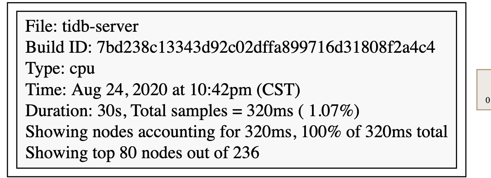
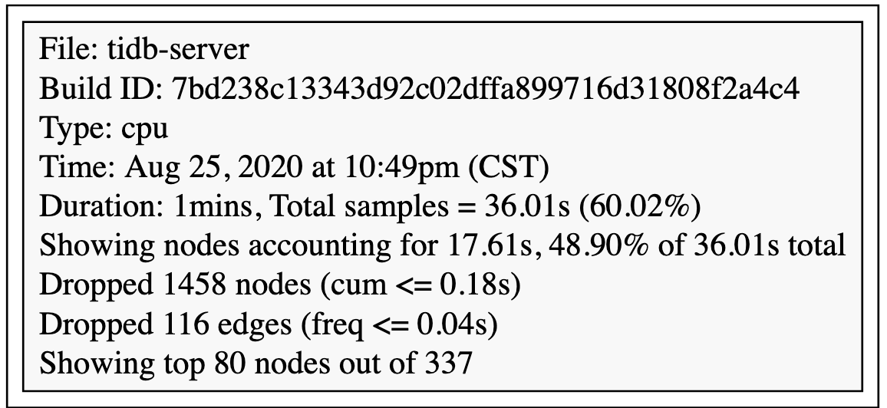

# TiDB-第二课 Benchmark


# 作业


题目描述：

使用 sysbench、go-ycsb 和 go-tpc 分别对 TiDB 进行测试并且产出测试报告。

测试报告需要包括以下内容

● 部署环境的机器配置（CPU、内存、磁盘规格型号），拓扑结构（TiDB、TiKV 各部署于哪些节点）

● 调整过后的 TiDB 和 TiKV 配置

● 测试输出结果

● 关键指标的监控截图

 ○ TiDB Query Summary 中的 qps 与 duration

 ○ TiKV Details 面板中 Cluster 中各 server 的 CPU 以及 QPS 指标

 ○ TiKV Details 面板中 grpc 的 qps 以及 duration


# 完成过程

## 步骤1： 安装TiDB集群

采用的部署架构为：1TiDB+3TiKV+3PD

共四台机器，其中TiDB为单独机器，TiKV和TiDB共用三台机器。

机器类型:

| 类别 | 名称                                                   |
| ---- | ------------------------------------------------------ |
| OS   | Linux (CentOS 7.3.1611)                                |
| CPU  | 40v vCPUs， Intel(R) Xeon(R) Silver 4210 CPU @ 2.20GHz |
| RAM  | 128GB                                                  |
| DISK | 2.6T SSD                                               |

TiDB节点

| ip    | TiDB | PD   | TiKV |
| ----- | ---- | ---- | ---- |
| node1 | 1    |      |      |
| node2 |      | 1    | 1    |
| node3 |      | 1    | 1    |
| node4 |      | 1    |      |


## sysbench测试

### Point select测试

```
数据准备
sysbench --config-file=config oltp_point_select --threads=16 --tables=16 --table-size=500000 prepare
测试命令：
sysbench --config-file=config oltp_point_select --threads=16 --tables=16 --table-size=500000 run
测试输出
[ 10s ] thds: 16 tps: 47638.60 qps: 47638.60 (r/w/o: 47638.60/0.00/0.00) lat (ms,95%): 0.41 err/s: 0.00 reconn/s: 0.00
[ 20s ] thds: 16 tps: 47765.55 qps: 47765.55 (r/w/o: 47765.55/0.00/0.00) lat (ms,95%): 0.41 err/s: 0.00 reconn/s: 0.00
[ 30s ] thds: 16 tps: 47563.06 qps: 47563.06 (r/w/o: 47563.06/0.00/0.00) lat (ms,95%): 0.41 err/s: 0.00 reconn/s: 0.00
[ 40s ] thds: 16 tps: 48381.34 qps: 48381.34 (r/w/o: 48381.34/0.00/0.00) lat (ms,95%): 0.40 err/s: 0.00 reconn/s: 0.00
[ 50s ] thds: 16 tps: 47859.13 qps: 47859.13 (r/w/o: 47859.13/0.00/0.00) lat (ms,95%): 0.40 err/s: 0.00 reconn/s: 0.00
[ 60s ] thds: 16 tps: 47416.73 qps: 47416.73 (r/w/o: 47416.73/0.00/0.00) lat (ms,95%): 0.41 err/s: 0.00 reconn/s: 0.00
[ 70s ] thds: 16 tps: 48306.80 qps: 48306.80 (r/w/o: 48306.80/0.00/0.00) lat (ms,95%): 0.40 err/s: 0.00 reconn/s: 0.00
[ 80s ] thds: 16 tps: 48206.76 qps: 48206.76 (r/w/o: 48206.76/0.00/0.00) lat (ms,95%): 0.39 err/s: 0.00 reconn/s: 0.00
[ 90s ] thds: 16 tps: 47721.02 qps: 47721.02 (r/w/o: 47721.02/0.00/0.00) lat (ms,95%): 0.41 err/s: 0.00 reconn/s: 0.00
[ 100s ] thds: 16 tps: 48692.75 qps: 48692.75 (r/w/o: 48692.75/0.00/0.00) lat (ms,95%): 0.39 err/s: 0.00 reconn/s: 0.00
[ 110s ] thds: 16 tps: 48464.00 qps: 48464.00 (r/w/o: 48464.00/0.00/0.00) lat (ms,95%): 0.39 err/s: 0.00 reconn/s: 0.00
[ 120s ] thds: 16 tps: 48586.73 qps: 48586.73 (r/w/o: 48586.73/0.00/0.00) lat (ms,95%): 0.39 err/s: 0.00 reconn/s: 0.00
[ 130s ] thds: 16 tps: 49114.04 qps: 49114.04 (r/w/o: 49114.04/0.00/0.00) lat (ms,95%): 0.39 err/s: 0.00 reconn/s: 0.00
```

后续改写验证还是采用TiDB二进制启动进行验证。

### Update index测试

```
测试命令
sysbench --config-file=config oltp_update_index --threads=16 --tables=16 --table-size=500000 run
测试结果
[ 10s ] thds: 16 tps: 4882.94 qps: 4882.94 (r/w/o: 0.00/4882.94/0.00) lat (ms,95%): 4.10 err/s: 0.00 reconn/s: 0.00
[ 20s ] thds: 16 tps: 4892.06 qps: 4892.06 (r/w/o: 0.00/4892.06/0.00) lat (ms,95%): 4.25 err/s: 0.00 reconn/s: 0.00
[ 30s ] thds: 16 tps: 4770.53 qps: 4770.53 (r/w/o: 0.00/4770.53/0.00) lat (ms,95%): 4.25 err/s: 0.00 reconn/s: 0.00
[ 40s ] thds: 16 tps: 3876.71 qps: 3876.71 (r/w/o: 0.00/3876.71/0.00) lat (ms,95%): 4.49 err/s: 0.00 reconn/s: 0.00
[ 50s ] thds: 16 tps: 4941.77 qps: 4941.77 (r/w/o: 0.00/4941.77/0.00) lat (ms,95%): 4.10 err/s: 0.00 reconn/s: 0.00
[ 60s ] thds: 16 tps: 4887.67 qps: 4887.67 (r/w/o: 0.00/4887.67/0.00) lat (ms,95%): 4.18 err/s: 0.00 reconn/s: 0.00
[ 70s ] thds: 16 tps: 4773.46 qps: 4773.46 (r/w/o: 0.00/4773.46/0.00) lat (ms,95%): 4.41 err/s: 0.00 reconn/s: 0.00
[ 80s ] thds: 16 tps: 4878.35 qps: 4878.35 (r/w/o: 0.00/4878.35/0.00) lat (ms,95%): 4.18 err/s: 0.00 reconn/s: 0.00
[ 90s ] thds: 16 tps: 4832.52 qps: 4832.52 (r/w/o: 0.00/4832.52/0.00) lat (ms,95%): 4.18 err/s: 0.00 reconn/s: 0.00
[ 100s ] thds: 16 tps: 4840.88 qps: 4840.88 (r/w/o: 0.00/4840.88/0.00) lat (ms,95%): 4.25 err/s: 0.00 reconn/s: 0.00
[ 110s ] thds: 16 tps: 4847.10 qps: 4847.10 (r/w/o: 0.00/4847.10/0.00) lat (ms,95%): 4.18 err/s: 0.00 reconn/s: 0.00
[ 120s ] thds: 16 tps: 4561.10 qps: 4561.10 (r/w/o: 0.00/4561.10/0.00) lat (ms,95%): 4.74 err/s: 0.00 reconn/s: 0.00
[ 130s ] thds: 16 tps: 4790.11 qps: 4790.11 (r/w/o: 0.00/4790.11/0.00) lat (ms,95%): 4.33 err/s: 0.00 reconn/s: 0.00
[ 140s ] thds: 16 tps: 4670.50 qps: 4670.50 (r/w/o: 0.00/4670.50/0.00) lat (ms,95%): 4.49 err/s: 0.00 reconn/s: 0.00
```

### Read-only测试

```
sysbench --config-file=config oltp_read_only --threads=16 --tables=16 --table-size=500000 run
测试结果
[ 10s ] thds: 16 tps: 1262.45 qps: 20215.19 (r/w/o: 17688.69/0.00/2526.50) lat (ms,95%): 21.50 err/s: 0.00 reconn/s: 0.00
[ 20s ] thds: 16 tps: 1279.49 qps: 20467.70 (r/w/o: 17908.71/0.00/2558.99) lat (ms,95%): 21.11 err/s: 0.00 reconn/s: 0.00
[ 30s ] thds: 16 tps: 1246.39 qps: 19945.18 (r/w/o: 17452.51/0.00/2492.67) lat (ms,95%): 21.89 err/s: 0.00 reconn/s: 0.00
[ 40s ] thds: 16 tps: 1277.62 qps: 20443.23 (r/w/o: 17887.99/0.00/2555.24) lat (ms,95%): 21.11 err/s: 0.00 reconn/s: 0.00
[ 50s ] thds: 16 tps: 1273.21 qps: 20371.73 (r/w/o: 17825.31/0.00/2546.42) lat (ms,95%): 21.11 err/s: 0.00 reconn/s: 0.00
[ 60s ] thds: 16 tps: 1285.78 qps: 20574.21 (r/w/o: 18002.55/0.00/2571.66) lat (ms,95%): 21.11 err/s: 0.00 reconn/s: 0.00
[ 70s ] thds: 16 tps: 1288.72 qps: 20615.93 (r/w/o: 18038.49/0.00/2577.44) lat (ms,95%): 20.74 err/s: 0.00 reconn/s: 0.00
[ 80s ] thds: 16 tps: 1254.99 qps: 20080.20 (r/w/o: 17570.33/0.00/2509.88) lat (ms,95%): 20.74 err/s: 0.00 reconn/s: 0.00
[ 90s ] thds: 16 tps: 1249.01 qps: 19984.39 (r/w/o: 17486.38/0.00/2498.01) lat (ms,95%): 21.11 err/s: 0.00 reconn/s: 0.00
[ 100s ] thds: 16 tps: 1292.19 qps: 20673.18 (r/w/o: 18088.71/0.00/2584.47) lat (ms,95%): 20.74 err/s: 0.00 reconn/s: 0.00
```


## go-ycsb测试

### workloada

```
数据准备
./go-ycsb load mysql -P workloads/workloada -p recordcount=5000000 -p mysql.host=10.114.11.46 -p mysql.port=4000 --threads 32
测试命令
./go-ycsb run mysql -P workloads/workloada -p recordcount=5000000 -p mysql.host=10.114.11.46 -p mysql.port=4000 --threads 32
run结果
Run finished, takes 130.084969ms
READ   - Takes(s): 0.1, Count: 509, OPS: 4065.3, Avg(us): 1756, Min(us): 798, Max(us): 9208, 99th(us): 7000, 99.9th(us): 10000, 99.99th(us): 10000
UPDATE - Takes(s): 0.1, Count: 483, OPS: 3980.8, Avg(us): 5273, Min(us): 2393, Max(us): 15315, 99th(us): 13000, 99.9th(us): 16000, 99.99th(us): 16000
```

### workloadc

```
测试命令
./go-ycsb run mysql -P workloads/workloadc -p recordcount=10000000 -p mysql.host=10.114.11.46 -p mysql.port=4000 --threads 32
测试结果
READ   - Takes(s): 0.1, Count: 992, OPS: 18863.2, Avg(us): 1654, Min(us): 816, Max(us): 16683, 99th(us): 12000, 99.9th(us): 17000, 99.99th(us): 17000

```

### workloadf

```
测试命令
./go-ycsb load mysql -P workloads/workloadf -p recordcount=10000000 -p mysql.host=10.114.11.46 -p mysql.port=4000 --threads 32
测试结果
READ   - Takes(s): 0.2, Count: 992, OPS: 5497.7, Avg(us): 2422, Min(us): 895, Max(us): 18902, 99th(us): 12000, 99.9th(us): 19000, 99.99th(us): 19000
READ_MODIFY_WRITE - Takes(s): 0.2, Count: 484, OPS: 2835.0, Avg(us): 8147, Min(us): 3482, Max(us): 29717, 99th(us): 24000, 99.9th(us): 30000, 99.99th(us): 30000
UPDATE - Takes(s): 0.2, Count: 484, OPS: 2833.5, Avg(us): 5583, Min(us): 2460, Max(us): 22814, 99th(us): 16000, 99.9th(us): 23000, 99.99th(us): 23000
```


## go-tpc测试

```
准备数据
./go-tpc tpcc -H 10.114.11.46 -P 4000 -D tpcc_yu --warehouses 10 prepare
测试命令
./go-tpc tpcc -H 10.114.11.46 -P 4000 -D tpcc_yu --warehouses 10 run
测试结果
Current] DELIVERY - Takes(s): 9.8, Count: 30, TPM: 183.3, Sum(ms): 1391, Avg(ms): 46, 90th(ms): 64, 99th(ms): 64, 99.9th(ms): 64
[Current] NEW_ORDER - Takes(s): 10.0, Count: 392, TPM: 2353.3, Sum(ms): 4879, Avg(ms): 12, 90th(ms): 16, 99th(ms): 32, 99.9th(ms): 40
[Current] ORDER_STATUS - Takes(s): 9.9, Count: 40, TPM: 242.7, Sum(ms): 186, Avg(ms): 4, 90th(ms): 8, 99th(ms): 16, 99.9th(ms): 16
[Current] PAYMENT - Takes(s): 10.0, Count: 400, TPM: 2403.3, Sum(ms): 2795, Avg(ms): 6, 90th(ms): 8, 99th(ms): 12, 99.9th(ms): 16
[Current] STOCK_LEVEL - Takes(s): 10.0, Count: 32, TPM: 192.4, Sum(ms): 302, Avg(ms): 9, 90th(ms): 12, 99th(ms): 16, 99.9th(ms): 16

[Summary] DELIVERY - Takes(s): 148.0, Count: 508, TPM: 205.9, Sum(ms): 23295, Avg(ms): 45, 90th(ms): 64, 99th(ms): 64, 99.9th(ms): 96
[Summary] NEW_ORDER - Takes(s): 148.1, Count: 5687, TPM: 2304.0, Sum(ms): 71537, Avg(ms): 12, 90th(ms): 16, 99th(ms): 32, 99.9th(ms): 40
[Summary] ORDER_STATUS - Takes(s): 147.7, Count: 528, TPM: 214.5, Sum(ms): 2474, Avg(ms): 4, 90th(ms): 8, 99th(ms): 8, 99.9th(ms): 24
[Summary] PAYMENT - Takes(s): 148.1, Count: 5581, TPM: 2260.8, Sum(ms): 39528, Avg(ms): 7, 90th(ms): 8, 99th(ms): 16, 99.9th(ms): 40
[Summary] PAYMENT_ERR - Takes(s): 148.1, Count: 1, TPM: 0.4, Sum(ms): 5, Avg(ms): 5, 90th(ms): 8, 99th(ms): 8, 99.9th(ms): 8
[Summary] STOCK_LEVEL - Takes(s): 148.0, Count: 493, TPM: 199.8, Sum(ms): 4819, Avg(ms): 9, 90th(ms): 12, 99th(ms): 24, 99.9th(ms): 48

```


## dashboard状态


# 分析

通过分析两次dashboard导出的TiDB profiling结果（分了两个不同时段进行测试）。







第一次profiling的耗时时间较久的主要是：

```
runtime futex 50ms (15.62%)
runtime sysmon 10ms (3.12%) of 20ms (6.25%)
runtime epollwait 20ms (6.25%)
```

第二次profiling的耗时时间较久的主要是：

```
runtime mallocgc 1.21s (3.36%) of 5.67s (15.75%)
runtime gcDrain 1.18s (3.28%) of 5.30s (14.72%)
runtime scanobject 1.15s (3.19%) of 3.24s (9.00%)
runtime futex 2.60s (7.22%)
runtime findrunnable 0.62s (1.72%) of 4.10s (11.39%)
runtime epollwait 0.73s (2.03%)
```


分析：

根据两次对比，第二次测试的场景有所不同，且60s的分析时间内，gc占用了主要的时间，其中包括对object的扫描，后续需要研究gc的算法，看是否可以在特殊场景时，减少gc消耗。

另外：两次均耗时较久的是runtime futex 和 runtime epollwait，这两个模块可以研究下。


# 总结

通过基准测试，能够了解通用的数据库测试方法，以及TiDB大致的性能，通过分析结果，初步了解性能瓶颈，但是只是表面看，需要后面深入的了解。

另外由于grafana配置有点问题，没有拿到监控图，了解也少了很多，后面会重新关注监控图。


> 参考内容：
>
> 1. TiUP单机部署: [本地快速部署 TiDB 集群](https://docs.pingcap.com/zh/tidb/dev/tiup-playground)
> 2. TiDB基准测试:[Sysbench 基准性能测试](https://github.com/pingcap-incubator/tidb-in-action/blob/master/session4/chapter3/sysbench.md)